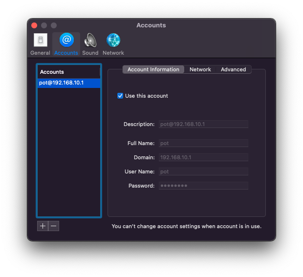

# CISCO7941

ようちえんの2月号付録CiscoのIP電話でお電話ごっこしましょう。

とりあえず動いたので上げとく．(https://twitter.com/ynakano1127/status/1517819351084142592)

[このサイト](https://www.whizzy.org/2017/02/23/cisco-7941-asterisk-and-sip/)に沿って設定したので，新しい情報はあまりないかもしれない．より具体的な設定ファイルの値を確認するときに使ってほしい．

アスタリスクの設定とかシスコ電話の設定とかでもっと遊べそう（ex.保留，保留の音，背景画像，着信音，[Twilioを使う](https://sumizome.hateblo.jp/entry/2019/12/11/020639)，VPN(L2TP/IPSec,SoftEther)を使って離れたお友達と通話）

**アスタリスクの設定があやふやで，[あやふわアスタリスク](https://www.youtube.com/watch?v=PomsMwiBgsw)！！！！！！！！**

大事なことなのでもう一度いいます．**アスタリスクの設定があやふやで，[あやふわアスタリスク](https://www.youtube.com/watch?v=PomsMwiBgsw)！！！！！！！！**
# 実験概要
下記2つを目的とした．
1. CISCO電話と他のコンピュータとの間でSIPを用いて発着信できるようにする
2. 音を送受信できるようにする

基本的に[このサイト](https://www.whizzy.org/2017/02/23/cisco-7941-asterisk-and-sip/)に基づく．大切なことはすべてここに書かれていると思う．

実験の大まかな構成図を以下に記す

ThinkPad上にdnsmasqとasteriskを入れてサービスを提供する．dnsmasqはDHCP・TFTPのために動かし，asteriskはSIPのために動かす．SIPクライアントとしてMacBookと今回の主役「CISCO電話」を用いる

SIPクライアント1とSIPクライアント2はDHCPで動的にIPアドレスを決める．CISCO電話はTFTPサーバーへアクセスし，設定ファイルやファームウェアを読み込む

SIPクライアント1に関して，SIPクライアントとしての値は以下の通り
* ユーザーネーム:yakan
* パスワード:password
* 内線番号:1

SIPクライアント2に関して，SIPクライアントとしての値は以下の通り
* ユーザーネーム:pot
* パスワード:password
* 内線番号:2

# 実験環境
## DHCPサーバー・SIPサーバー・TFTPサーバー
* ThinkPad T14 Gen 2 (intel)
* Manjaro Linux(kernel version 5.13.19-2)

## SIPクライアント1
* CP-7941G
* firmware version 41.9-2-1S

## SIPクライアント2
* MacBook Pro 13-inch 2020
* macOS Monterey

## L2Switch
* LSW4-GT-8NS/BK
## その他
* ELECOMのイーサネットケーブル
* 中華製の怪レいPoEインジェクター

# パッケージ
* https://aur.archlinux.org/packages/asterisk-cisco
* https://www.archlinux.jp/packages/?name=dnsmasq
# ファイル情報
なにか操作を行ったファイル（他にもあるかもしれない）
* /etc/asterisk/sip.conf
* /etc/asterisk/extensions.conf
* /etc/asterisk/rtp.conf
* /etc/dnsmasq.conf

## tftpのディレクトリ内
* /srv/tftp/SEPXXXXXXXXXXXX.cnf.xml
* /srv/tftp/cmterm-7941_7961-sip.9-2-1.tar
* /srv/tftp/apps41.9-2-1TH1-13.sbn
* /srv/tftp/cnu41.9-2-1TH1-13.sbn
* /srv/tftp/cvm41sip.9-2-1TH1-13.sbn
* /srv/tftp/dsp41.9-2-1TH1-13.sbn
* /srv/tftp/jar41sip.9-2-1TH1-13.sbn
* /srv/tftp/SIP41.9-2-1S.loads
* /srv/tftp/term41.default.loads
* /srv/tftp/term61.default.loads

１つ目の`/srv/tftp/SEPXXXXXXXXXXXX.cnf.xml`(`X`はMACアドレス16進12桁)のみ作成した．それ以降のものはファームウェアの圧縮ファイルもしくはその圧縮ファイルを解凍して現れたものである．
# Telephoneの設定

# トラブル
切り分けをしましょう．無限に原因が湧いてくるので．
## 考える原因の一例
* 各機器のファイアウォールの設定．特にWindowsの場合は「ドメインネットワーク」，「プライベートネットワーク」，「ゲストまたはパブリックネットワーク」のどれかを気にしましょう
* IPアドレスを間違えている
### SIPクライアント（ユーザーエージェント）が悪い
* ファームウェアのファイルが壊れている
* ファームウェアが焼けていない
* DCHPでIPが割り振られていない
* 設定ファイルの構文エラー，設定抜け，間違った値の設定
### DHCPサーバー・TFTPサーバー・SIPサーバーが悪い
* dhcp・tftp・sipサーバーが起動できていない
* tftpサーバーの権限がない
* tftpで配信するファイルの権限がおかしい
* SIPサーバーの設定が悪い

# 編集後記
ファームウェアが壊れてるのに気づかずだいぶ時間を使ってしまった．

色々本文に足りないところがあるのは自覚しているが，done is better than perfect精神でとりあえずcommit&pushする．（怒らないで）

CISCO電話，どうやってTFTPサーバーみつけてるんだろうか．wiresharkでDHCPのオプション見たけどそれっぽいのがなかった．

実験した日からだいぶ時間をあけてこの文章を書いてあるので，けっこう間違ってると思う．

アスタリスクの設定，特に内線番号とかユーザーネームとかの設定は重要なのによくわかってないので，時間をとって理解したい

ネットを探してもSIPの基本動作すらまともに説明してる記事がなかった．大学の図書館にSIPのあれこれが書かれたクソデカ本が何冊かあって非常に助かった！

動作確認のとき，一人で「あーーー」とか「あいうえおー」ってやるの，ちょっと悲しい．でもつながったときは嬉しかった

以上．つくば電信電話公社 甲府支部からお送りしました．

